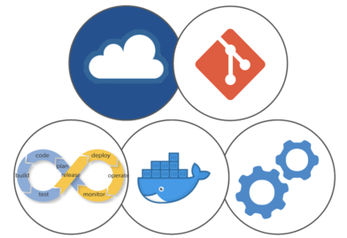

# DevOps Course

## Office Hours

* [Schedule a Conversation](https://calendly.com/uli-hitzel/catchup-30-min)

## Links

* [A] [LinkedIn Profile](https://www.linkedin.com/in/uhitzel/)
* [B] [DevOps Telegram Channel](https://t.me/devopsupdates)
* [C] [Qwiklabs Sign Up](https://bit.ly/free-qwiklabs2020)
* [D] [Google Cloud Console](https://console.cloud.google.com/)
* [E] [Google Cloud Shell](https://console.cloud.google.com/home/dashboard?cloudshell=true)
* [F] [Google Cloud Shell with Editor](https://ssh.cloud.google.com/cloudshell/editor?hl=en_GB&fromcloudshell=true)
* [G] [MongoDB Cloud](https://www.mongodb.com/cloud/atlas/lp/try2)

## Exercises

* [1] [Google Qwiklabs](https://www.qwiklabs.com/)
* [2] Google Cloud Essentials:
    * [3] [Enroll in the 'Quest'](https://google.qwiklabs.com/quests/23)
    * [4] - [Create Virtual Machine](https://google.qwiklabs.com/focuses/3563?parent=catalog)
    * [5] - [Deploy on Kubernetes](https://google.qwiklabs.com/focuses/878?parent=catalog)
* [6] [MongoDB Getting Started](https://github.com/u1i/mongodb-getting-started)
* [7] [Docker Hello](https://github.com/u1i/docker-hello)
* [8] [NodeJS API in Docker](https://github.com/u1i/nodejs-api)
* [9] [GitHub Actions Example](https://github.com/u1i/ghactions-test)
* [10] [ARM Templates](https://github.com/u1i/azure-arm
)
* [11] [Ansible Exercise](https://github.com/u1i/ansible-exercise)
* [12] [GCP Deployment Manager](https://google.qwiklabs.com/focuses/863?parent=catalog)
* [13] [Try Azure App Service](https://azure.microsoft.com/en-us/try/app-service/)
* [14] [Netlify CMS](https://github.com/u1i/gatsby-starter-netlify-cms)
* [15] [k3s Exercise](https://github.com/u1i/k3s-quickstart)
* [16] [Docker Hello – Auto Build](https://github.com/u1i/docker-hello-autobuild)
* [17] [Kubernetes in Google Cloud Shell](https://shell.cloud.google.com/?walkthrough_tutorial_url=https%3A%2F%2Fwalkthroughs.googleusercontent.com%2Fcontent%2Fgke_cloud_code_create_app%2Fgke_cloud_code_create_app.md&show=ide&environment_deployment=ide)
* [18] [scrumblr](https://github.com/aliasaria/scrumblr) | [Containerized Version](https://github.com/u1i/scrumblr-docker)

## Course Outline & Suggested Material for Preparation

### Day 1 (half day)

* Modern Application Design – The Big Picture
* Why DevOps?
* Cloud Computing
* Git

#### Videos

* [What is DevOps? (2 min)](https://www.youtube.com/watch?v=aFWi8ToAjpU)
* [Cloud Computing Defined (2 min)](https://www.youtube.com/watch?v=ZnGzxV_dQeg)
* [What is Git? (2 min)](https://www.youtube.com/watch?v=2ReR1YJrNOM)

#### Material

* [Cloud Computing Explained (ZDNet)](https://www.zdnet.com/article/what-is-cloud-computing-everything-you-need-to-know-about-the-cloud/)
* [What is Git & How to Use It](https://www.freecodecamp.org/news/what-is-git-and-how-to-use-it-c341b049ae61/)
* [GitHub First Steps](https://guides.github.com/activities/hello-world/) | [Git Guide](https://rogerdudler.github.io/git-guide/)

### Day 2 (Full Day)

* Recap: The Need for DevOps, Cloud Computing, Git
* CI/CD, Pipelines
* Kanban, Agile & Scrum
* Containers & Kubernetes
* Automation & Infrastructure-as-Code

#### Videos

* [CI/CD Explained in 100 Seconds (2 min)](https://www.youtube.com/watch?v=scEDHsr3APg)
* [Scrum 7 min explainer video](https://www.youtube.com/watch?v=9TycLR0TqFA)
* [Docker in 100 Seconds](https://www.youtube.com/watch?v=Gjnup-PuquQ)
* [Kubernetes in 100 Seconds](https://www.youtube.com/watch?v=PziYflu8cB8)
* [Infrastructure-as-Code (3 min)](https://www.youtube.com/watch?v=RO7VcUAsf-I)

#### Material

* [DevOps Basics](https://ddls.com.ph/wp-content/uploads/2018/05/devops-the-basics-v1-r1.0.pdf)
* [What's Agile & Scrum?](https://www.cprime.com/resources/what-is-agile-what-is-scrum/)
* [Docker Introduction](https://medium.com/zero-equals-false/docker-introduction-what-you-need-to-know-to-start-creating-containers-8ffaf064930a)
* [What's GitHub Actions?](https://itnext.io/getting-started-with-github-actions-fe94167dbc6d)

### Day 3 (Show & Tell)

The stage is yours!

* Projects – choose one of the following
    * (1) [BCM Pte Ltd.](./projects/bcm.md) --> your deliverable is a slide deck
    * (2) [CI/CD](./projects/tech.md ) --> your deliverable is a GitHub repository with code & descriptions. No slides!

* One project per student, no group work

	* The descriptions are vague on purpose and meant to inspire your creativity & give you freedom to build a project based on your ideas, interest, and level of technical debt.
	* Try your best not to think of the project as 'homework submission', but your chance to apply what you learned
	* For the BCM project: assume you're speaking to an executive panel (the customer) in that session
	* For the technical project: much more important than actual coding miracles is clearly showing & illustrating what you are trying to achieve, which steps you take, and what the desired outcome is (README.md). If you can make automated (parts!) of the CI/CD workflow happen, even better! Clone and adapt some of the examples from the course to get you started!

* Submit into the 'Show and Tell' folder in LumiNUS by 8pm the night before the session:
	* a slide deck (PDF) – if you chose project (1)
	* a text file that contains your name + a link to a public GitHub repo – if you chose project (2)
* Get ready to present at the Show & Tell! In the interest of time we will use ONE laptop where we run all slides & projects from
* Attendance is compulsory. If you have a valid reason why you are not able to join the Show & Tell session, you are expected to record a short video (max 5 minutes) where you:
	* assume you're speaking to an executive panel (the customer) – if you chose project (1)
	* show what you built & talk about your approach – if you chose project (2)
	* how to record such a video? Get on a Zoom call with yourself, press record, share the screen and you're in business. After that, upload the file to LumiNUS.

## Tools & References

* [Scrumblr – simple Kanban board](http://scrumblr.ca/)
* [Flyin Donut – free scrumban tool](https://www.flyingdonut.io/)
* [Markdown Cheat Sheet](https://github.com/adam-p/markdown-here/wiki/Markdown-Cheatsheet)
* [MongoDB 5 min explainer video](https://www.youtube.com/watch?v=EE8ZTQxa0AM)

## Other Material & Links

* [What is Ethereum? A Beginner's Explanation in Plain English
 (11 min)](https://www.youtube.com/watch?v=jxLkbJozKbY)
* [Blockchain 101 Visual Demo](https://www.youtube.com/watch?v=_160oMzblY8)
* [Free Subdomains for your GitHub Pages etc](https://freedns.afraid.org/)
* [Using Git with VS Code](https://code.visualstudio.com/docs/editor/versioncontrol)
* [AI research – GPT-3](https://apigeek.net/#openai--gpt-3)